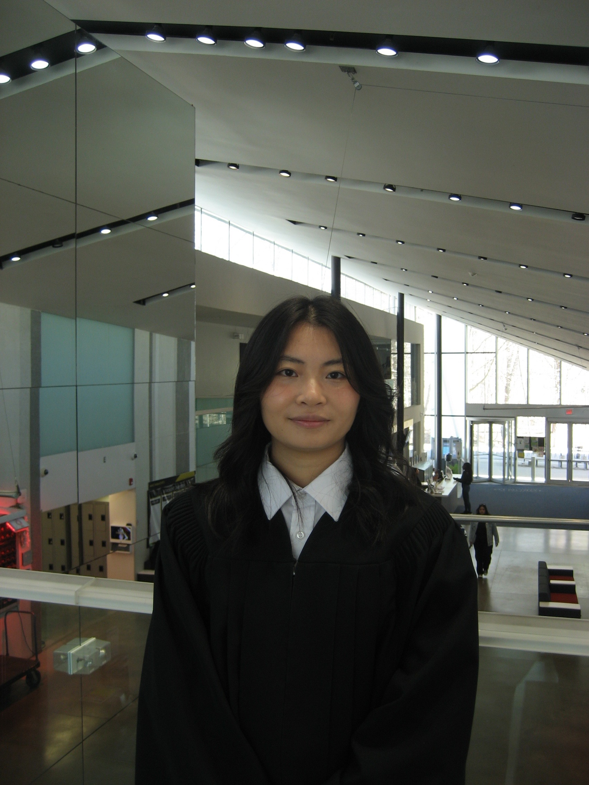

  
  

    I recently graduated from the University of Toronto, specializing in Computer Science with a minor in Biology. Now that I’m stepping into the real world, I’m working as a Data Engineer at Hubio.
      
    In this fast-moving tech world, I want to document my journey as I work toward becoming a more reliable and thoughtful engineer — starting with my path to becoming a Rustacean.
      
    Some of my hobbies include backcountry camping, climbing in all forms (outdoor, indoor, boards), and playing ice hockey.
  

